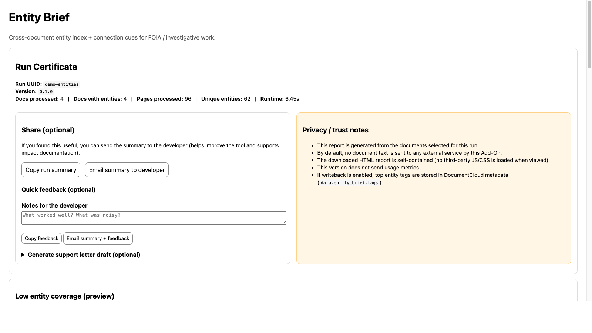

# Entity Brief

A DocumentCloud Add-On that aggregates extracted entities across documents into a single HTML report with visualizations and connection analysis. It is designed for FOIA requesters and investigative reporters who need a fast cross-document index of names, organizations, and places.

## Quick Start (DocumentCloud UI)

1) Ensure entities exist for the documents (named people/orgs/places from **Edit -> Entities -> Extract entities**, or an extraction add-on).
2) Select documents (or run a query).
3) Run **Entity Brief**.
4) Download the single HTML report from the add-on run.

## Who it's for

- FOIA requesters working through large batches of released documents.
- Reporters who need a cross-document index of names, organizations, and places to prioritize follow-up.

## Demo Output

Sample report: `docs/demo/entity-brief-demo.html`

<p>
  
</p>
<p>
  
</p>
<p>
  
</p>

## What it does

- Reads existing entities for the selected/query documents.
- Normalizes and aggregates entities across documents.
- Builds a single HTML report with a run certificate, top entities chart, co-occurrence list, and an entity index.
- Uploads that report to the add-on run via `upload_file()`.

## What it does not do

- It does not extract entities itself (run entity extraction first).
- It does not upload documents.
- It does not write tags or other metadata back to documents in v1.

## Requirements

Documents must have entities extracted before running this Add-On. Use DocumentCloud's built-in entity extraction (**Edit -> Entities -> Extract entities**) or another extraction Add-On first.

## Output Sections

- Run Certificate (UUID, version, doc/page counts, runtime).
- Top Entities chart (doc coverage).
- Top Connections list (co-occurrence with page examples).
- Entity Index (doc links, pages, sample snippets).
- Skipped (no entities) and Failures.
- Low entity coverage warning (when too few docs have entities).

## How to read the report

- The Top Entities chart shows **how many documents** mention each entity.
- The Entity Index shows which documents/pages mention the entity, plus sample snippets.

## Features

- **Top Entities Chart** - D3 bar chart showing entities by document coverage
- **Connection Analysis** - Page-level co-occurrence pairs with example pages
- **Entity Index** - Expandable list with doc links, page refs, and evidence snippets
- **Filters & Exports** - Filter by kind/coverage, stoplist names, and export CSV/JSON from the report

## Configuration

| Option | Default | Description |
|--------|---------|-------------|
| Max documents | 25 | Safety cap for query runs |
| Min relevance | 0.15 | Filter threshold (0.0-1.0) |
| Top N entities | 15 | Chart/list size limit |
| Include connections | true | Enable co-occurrence analysis |

## Output

Single HTML file: `entity-brief-<run_uuid>.html`

Note: D3 charts render in a browser. IDE previews that do not run JS will not show the chart.

## Privacy

- Reads only document metadata and existing entity extractions
- No third-party API calls beyond DocumentCloud
- No telemetry or data collection
- Report loads D3.js from CDN when viewed

## Local Development

```bash
python -m venv .venv && source .venv/bin/activate
pip install -r requirements.txt
```

Find public docs with entities:

```bash
python scripts/find_public_docs_with_entities.py --limit 10
```

Generate a local demo report (no upload):

```bash
python scripts/generate_demo_report.py 123456 --output docs/demo/entity-brief-demo.html
```

Run the add-on against selected docs inside the DocumentCloud UI for full end-to-end testing.

## Testing and Demo

- Test workflow: `docs/TESTING.md`
- Demo report and screenshots: `docs/demo/`

## License

BSD 3-Clause
